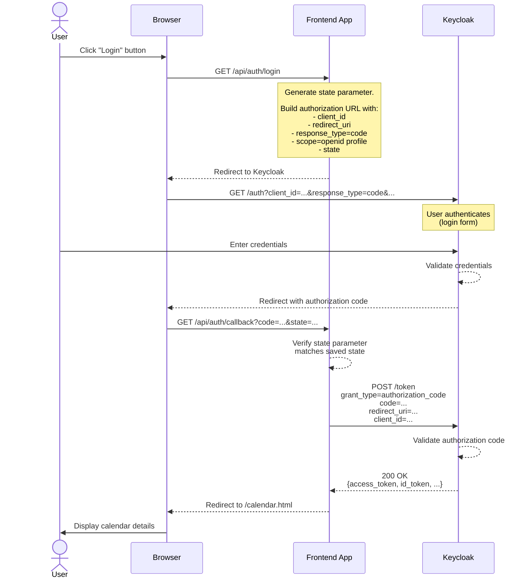
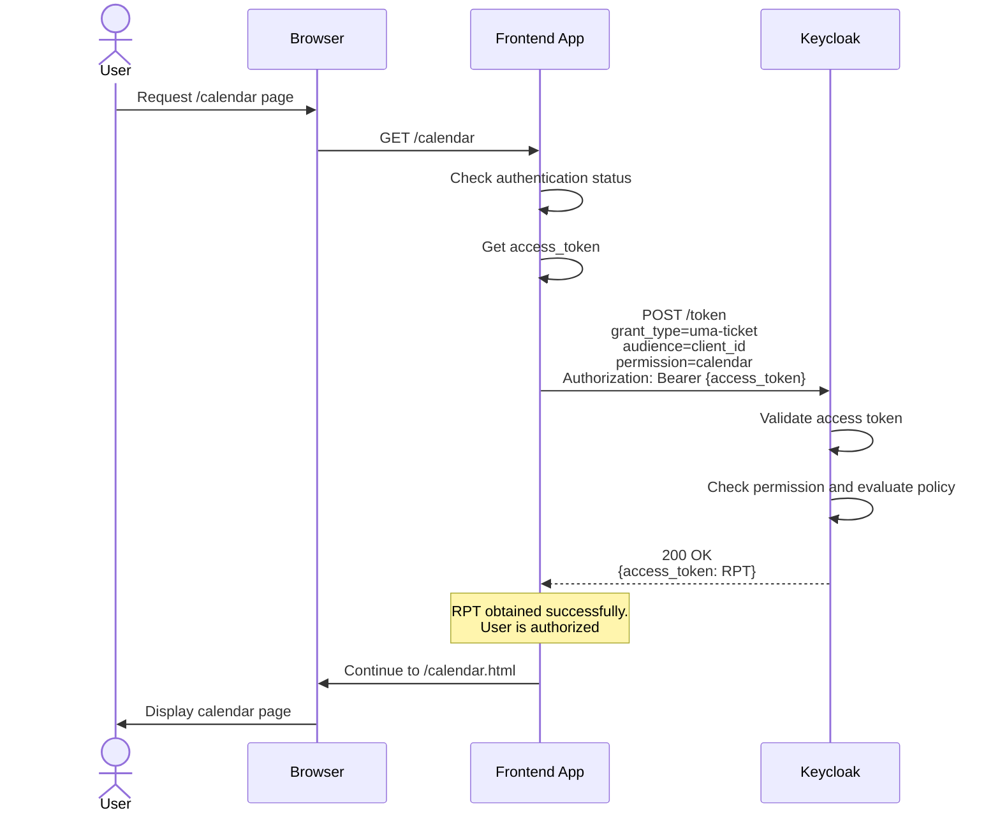
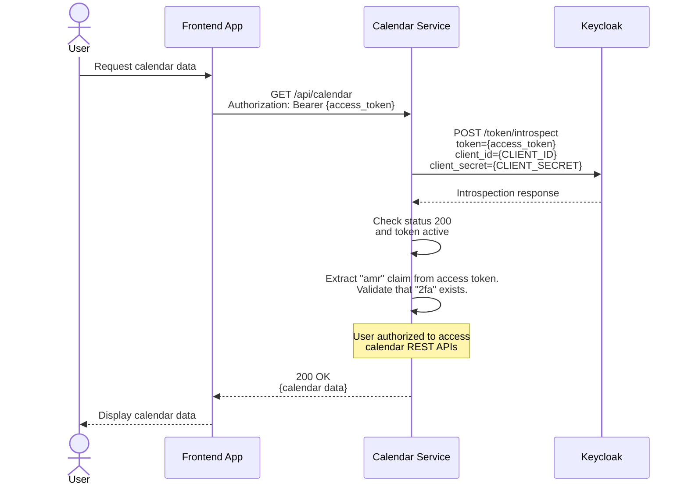

# Exercise 1 - Frontend App with OIDC Integration

## Overview

This document provides a comprehensive analysis of the architecture, design decisions, and trade-offs associated with implementing a web application and REST service secured by Keycloak.

The implementation addresses specific objectives within this demonstration scenario. This document details the technical approach and rationale for each requirement.

## Objectives

### 1. Allow the user to log in and obtain tokens from Keycloak.

The implementation utilizes the OIDC Authorization Code flow to facilitate user authentication and token acquisition, as illustrated in the following sequence diagram:

#### Keycloak Configuration
  - Configure a new client with Client Authenticator set to "Client ID and Secret".
  - Extract the client ID and secret, then inject them as environment variables for the frontend application.

#### Relevant Code Files
  - ~/frontend-app/src/main/java/com/example/app/resources/AuthResource.java
  - ~/frontend-app/src/main/webapp/index.html

#### Alternative Approaches Considered

The OIDC Resource Owner Password Credentials (ROPC) flow represents an alternative implementation approach. However, this method introduces significant security vulnerabilities as it requires the frontend application to directly handle user credentials. The Authorization Code flow mitigates this risk by delegating credential collection to the identity provider (Keycloak).

The Implicit flow was also evaluated but rejected due to inferior security characteristics, specifically the exposure of tokens in URI fragments. This approach is deprecated and strongly discouraged in current security best practices.

### 2. Role-Based Access Control

This objective encompasses the following requirements from the exercise:
  - Authorize access only if the logged-in user has the role my-role. Users without this role should not be authorized.
  - (Bonus) Externalize the authorization rule (role my-role) so it can be managed outside of the application (e.g., via Keycloak itself), decoupling authorization from the application layer.

#### Keycloak Configuration
  - Define a realm role named 'my-role'.
  - Access the 'frontend-app' client configuration established in the previous objective.
  - Navigate to Authorization -> Resources.
  - Define a protected resource for the URI '/calendar' (Note: This URI references the frontend-app page, not the calendar service API endpoint).
  - Navigate to Authorization -> Policies.
  - Configure a policy that evaluates to true when the 'my-role' role is present in the user's token.
  - Navigate to Authorization -> Permissions.
  - Establish a resource-based permission that applies the my-role policy to the calendar resource.

#### Runtime Flow

#### Relevant Files
  - ~/frontend-app/src/main/java/com/example/app/filters/AuthorizationFilter.java

#### Alternative Approaches Considered

  1. Token-based role extraction: The access token could be decoded locally or introspected via Keycloak to extract user roles. Access would be granted if the required role is present. However, this approach centralizes authorization logic within the application layer, contradicting the principle of externalized authorization.
  2. Authentication-time policy enforcement: For single-page applications, policy evaluation could occur during the authentication phase, preventing token issuance when policy evaluation fails. 

### 3. Protect calendar service REST APIs with Keycloak

This objective covers the following tasks from the exercise:
  - Call a REST service named calendar, which must be protected by Keycloak tokens. Only requests with a valid Keycloak token should succeed.
  - Display the data returned by the calendar service in the frontend-app.
  - (Bonus) Require that only users who have enabled and authenticated with 2-factor authentication can access the calendar service. Users with password-only authentication should receive a 403 response.

The implementation approach is illustrated in the following sequence diagram:

#### Keycloak Configuration
  - Access the Browser flow configuration in the Authentication section.
  - Configure the "OTP Form" step by adding "2fa" to the Authenticator Reference field.
  - Navigate to the frontend-app client settings, then access Client Scopes -> frontend-app-dedicated.
  - Add a mapper by configuration.
  - Select the AMR (Authentication Methods Reference) type mapper and ensure "Add to access token" is enabled.
  - Provision a new client for the calendar service to facilitate token introspection.

#### Relevant Files
  - ~/calendar/src/main/java/com/example/calendar/filter/AuthorizationFilter.java

#### Alternative Approaches Considered

  1. ACR (Authentication Context Class Reference) claim: The "acr" claim could be utilized instead of "amr". However, this approach is only effective when requesting a new token specifically for calendar service access. Given that the implementation reuses the access token from the initial frontend-app authentication, the "amr" claim provides a more efficient solution for meeting the objective.
  2. Introspection response enhancement: Including the "amr" claim directly in the introspection response would eliminate the need to decode the JWT access token.

### 4. Sender-Constrained Token

The objective here was to ensure the access token is sender-constrained, so the calendar service cannot reuse it to call other endpoints (e.g., Keycloak’s UserInfo endpoint).

This was ensured by enabling mTLS bound access tokens for the frontend-app client on Keycloak.

#### Keycloak Configuration
  - Access the frontend-app client configuration on the Keycloak server and navigate to the Advanced tab.
  - Enable "OAuth 2.0 Mutual TLS Certificate Bound Access Tokens" under Advanced settings.
  - Navigate to the Credentials tab and configure the Client Authenticator to X509 Certificate.
  - Generate a Keycloak keystore and truststore containing the frontend-app's trusted certificate. Mount these keystores to the Keycloak container.
  
#### Frontend Application Configuration
  - Generate the required certificates to establish an mTLS connection with Keycloak.

#### Runtime Flow

  - When the frontend application initiates the Authorization Code flow, it utilizes an HTTP client configured with the client keystore.
  - The `/token` endpoint call to Keycloak is executed using only the client_id parameter, omitting the client_secret.
  - The resulting access token contains a `cnf` (confirmation) claim representing the thumbprint of the client certificate presented by the frontend application.
  - When this token is presented to a resource server, the `cnf` claim is validated against the client certificate in the current mTLS connection. This cryptographic binding ensures the token is sender-constrained and cannot be utilized by unauthorized third-party applications.

#### Relevant Files

  - ~/frontend-app/src/main/java/com/example/app/resources/AuthResource.java

#### Alternative Approaches Considered

Demonstrating Proof-of-Possession (DPoP) is an alternative mechanism for implementing sender-constrained tokens. This approach was initially prioritized; however, technical challenges were encountered when requesting a RPT with a DPoP proof.