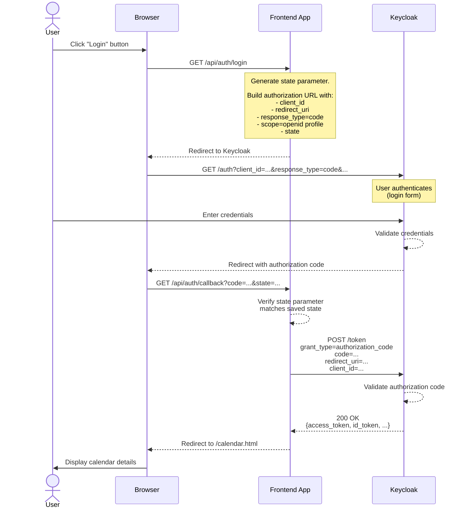
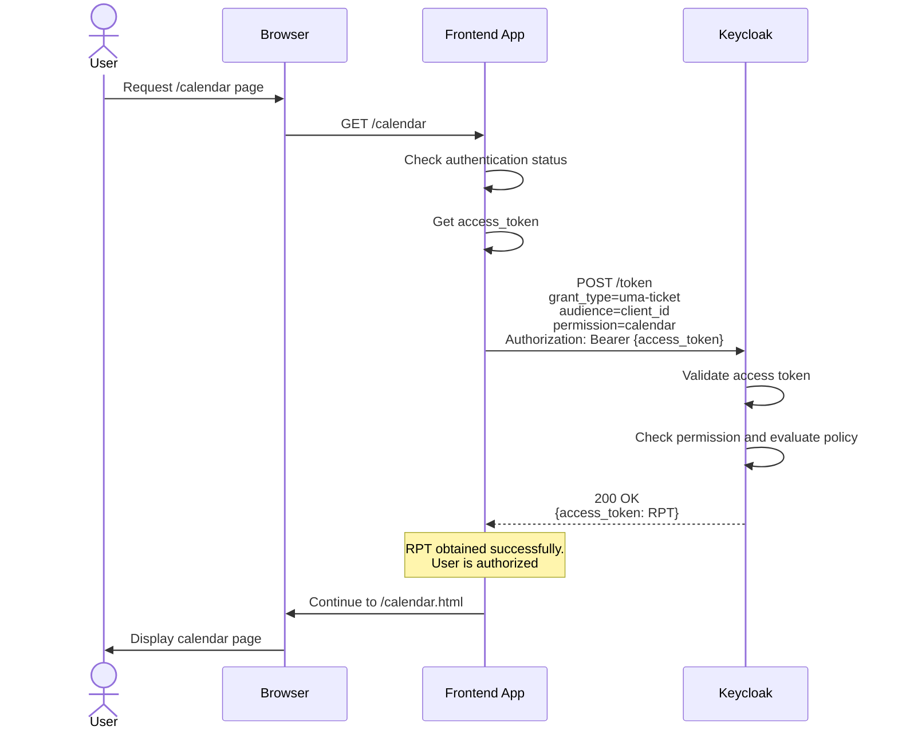
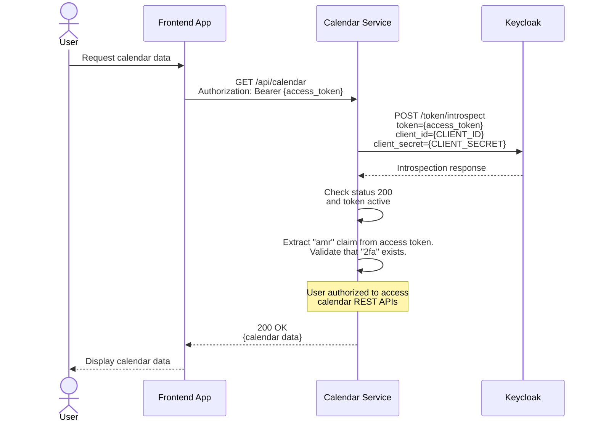

# Exercise 1 - Frontend App with OIDC Integration

## Overview

This document aims to highlight the architecture, design choices, and trade-offs related to creating a web application and a REST service that is protected by Keycloak.

Certain objectives were targeted and met in the implementation of this demo scenario. This document will try to go into details of each of those tasks.

## Objectives

### 1. Allow the user to log in and obtain tokens from Keycloak.

This was achieved by using OIDC Authorization Code flow, as illustrated in this sequence diagram:

#### Configuration on Keycloak
  - Create a new client and set the Client Authenticator to be "Client Id and Secret". 
  - Copy the client ID and secret and inject it as the frontend-app's environment variable.

#### Relevant Code files
  - ~/frontend-app/src/main/java/com/example/app/resources/AuthResource.java
  - ~/frontend-app/src/main/webapp/index.html

#### Alternatives considered

The same task can be achieved using the OIDC ROPC flow as well. The downside of that approach is that the frontend application will have to collect the user's credentials, which is a major security concern. In the auth code flow, the user enters their credentials directly on the Identity provider (Keycloak).

The Implicit flow is another option but that is even less secure because it includes the tokens in the URI fragment. This practice is now deprecated and highly discouraged.

### 2. Only authorize access if the user is part of 'my-role'

This task was combined with the Bonus task of "externalizing the authorization rule". For this, some permissions were configured on the Keycloak server.

#### Configuration on Keycloak
  - Create a realm role called 'my-role'
  - Open the details of the 'frontend-app' client created in the previous task.
  - Go to Authorization -> Resources
  - Create a resource to protect the URI '/calendar'. (Note this URI is for the page on frontend-app and not the calendar service API)
  - Go to Authorization -> Policies
  - Create a policy that evaluates to true if the role 'my-role' is present.
  - Go to Authorization -> Permissions
  - Create a Resource-Based permission that protects the calendar resource with the my-role policy.

#### Runtime flow

#### Relevant Files
  - ~/frontend-app/src/main/java/com/example/app/filters/AuthorizationFilter.java

#### Alternatives considered

  1. The access token could be unpacked on frontend-app, or introspected by Keycloak to get the roles that the user is part of. If the required role exists, allow access to the page. But this would mean that the application itself is in-charge of the authorization of the users.
  2. Since this could be a single-page application, it may be ok to enforce the policy on the authentication step itself. So, keycloak does not issue an access token on login if the policy evaluation fails. 

### 3. Protect calendar service REST APIs with Keycloak

This objective covers the following tasks from the exercise:
  - Call a REST service named calendar, which must be protected by Keycloak tokens. Only requests with a valid Keycloak token should succeed.
  - Display the data returned by the calendar service in the frontend-app.
  - (Bonus) Require that only users who have enabled and authenticated with 2-factor authentication can access the calendar service. Users with password-only authentication should receive a 403 response.

The manner to achieve this is illustrated by this sequence diagram:

#### Keycloak configuration
  - Open the Browser flow in the Authentication page
  - In the "OTP Form" step, click on settings. Add "2fa" to the Authenticator Reference.
  - Go to the frontend-app client settings. Go to Client Scopes -> frontend-app-dedicated.
  - Add mapper by configuration.
  - Select AMR type mapper. Make sure that "Add to access token" is turned on.
  - Create a new client for calendar service (to be used for the introspection call).

#### Relevant Files
  - ~/calendar/src/main/java/com/example/calendar/filter/AuthorizationFilter.java

#### Alternatives considered

  1. Use "acr" instead of "amr". But this would only be effective if the user was requesting for a new token to access calendar service. Since we are re-using the user's access token from the initial login to frontend-app, the approach to use "amr" seemed more efficient in completing the objective.
  2. Include "amr" claim in the introspection response. This would avoid a step to unpack the JWT access token and extract the claim. 

